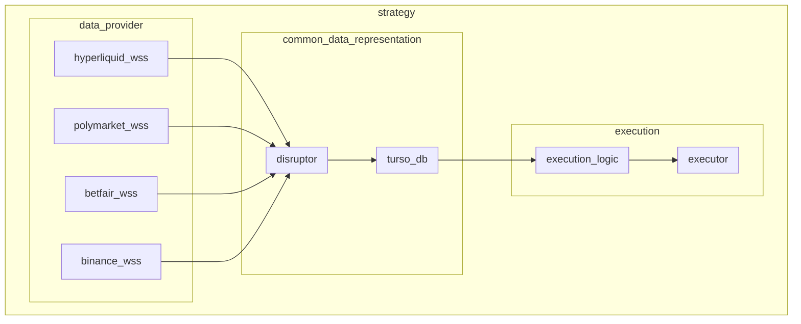

# sbOogway's market making arbitrage

## about
framework for market making and arbitrage on various exchanges and assets

## architecture

```mermaid
flowchart TD
    subgraph strategy
        subgraph execution 
            
            subgraph executor [executor]
            end
            subgraph execution_logic [execution_logic]
            end
            
        end
        subgraph common_data_representation
            direction LR
            
            subgraph turso_db [turso_db]
            end
            subgraph disruptor [disruptor]
            end

        end

        subgraph data_provider
            hyperliquid_wss
            polymarket_wss
            betfair_wss
            binance_wss
        end

        
    end

    hyperliquid_wss --> disruptor
    polymarket_wss --> disruptor
    betfair_wss --> disruptor
    binance_wss --> disruptor

    disruptor --> turso_db

    turso_db --> execution_logic

    execution_logic --> executor

```
